# 第二章 开发环境以及运行环境搭建
## 开发环境
### 开发环境介绍
开发环境是指本项目开发期间所需要的环境、平台和相关工具等，对开发环境的介绍可以让读者初步了解开发本项目工作期间涉及到的相关工具技术等等，对于想要二次开发的读者也可以根据本章节对本地环境进行快速搭建。  

* 系统：本项目开发系统为MacOS，MacOS是苹果公司自行研发的基于Unix内核的操作系统，最新版本已经到macOS 10.14.5(2019-05-11)，作者是在一台MacBook Pro上使用MacOS并搭建了最基础的开发环境进行开发本项目。由于本项目设计面向Unix和Linux内核系统，因此开发者可以在任何以Unix和Linux内核的系统上搭建开发环境；但是请确保内核版本为当前最新版本（2019年5月11号Linux当前内核最新版本5.1）。
* 运行环境：本项目需要python2.7.x、Vue.js以及前端运行环境；作者开发使用Python2.7.15版本，本项目没有兼容Python3，因此务必保证Python环境的正确；Vue.js依赖Node.js运行，作者Node.js版本为11.6.0，Vue.js为Vue2.9.6，由于Node采用向后兼容策略，因此只需要保证能够正确运行Vue.js即可，不需要Node.js版本完全一致；前端页面运行需要在浏览器上进行，作者使用Chrome作为运行环境，同时Chrome有非常友好的开发者调试工具，可以在页面上设置监控和断点帮助开发者在页面上debug。
* IDE：作者使用VsCode作为开发IDE，由于项目会涉及多种语言环境，因此使用VsCode结合插件搭建复杂项目环境，另外VsCode支持编辑-编译-调试-部署等开发流程，因此可以减少很多人工操作。
* 代码管理：作者使用git作为项目的版本控制工具，使用github作为代码托管平台；github目前支持创建免费私人仓库，因此本项目选择以私人仓库进行托管。

### 开发环境搭建
本节讲解如何在个人PC上搭建基础开发环境，读者可以依照本节内容在本地进行搭建。  

* 系统：由于需要Unix或者Linux内核操作系统，如果是MacOS系统则只需要保证系统版本在10.x以上即可，如果是Windows，可以考虑本地虚拟机、双系统和云服务器三种解决方法。本地虚拟机是使用例如Vmware等设备虚拟软件创建虚拟环境搭建系统环境的方法，可以在Vmware官方网站下载Vmware workstation安装，然后下载Unix或者Linux内核的操作系统例如FreeBSD、Ubuntu等等，作者推荐Ubuntu18.04系统，当然有经验的开发者也可以选择自己习惯的操作系统，下载之后在Vmware中使用下载镜像安装系统即可。双系统可以参考网上相关安装教程，本方案适用于有经验的开发者使用，因此作者并不推荐；云服务器是用户向云服务供应商购买的机器资源，具有机器资源可配置、可扩展、可升级等优势，同时提供大量集成系统镜像，支持市面上所有常见系统安装，因此作者非常推荐这种方式，可以在腾讯云、阿里云等平台购买学生服务器，选择Ubuntu18.04系统安装，通过提供的IP地址使用ssh登录即可，对于没有命令终端使用经验的用户会有操作障碍。
* 运行环境：安装python2.7.x版本，在MacOS上系统内置Python环境就是Python2.7.x因此可以选择跳过本节，如果是Ubuntu18.04在python官网下载Python2.7.15安装包，解压之后进入解压目录执行`./configure && make && make install`即可，使用`python2 -V`检查python版本。其他系统可以参考网上教程进行下载安装。安装Node.js，执行`sudo apt update && sudo apt install nodejs && sudo apt install npm`下载和安装node和npm，使用`node -v`和`npm -v`来查看安装结果。如果在云服务器上搭建开发环境，那么需要通过浏览器访问服务器地址访问页面，如果是MacOS只需要访问本地回环地址即可；在云服务器上需要确保服务器安全组里边端口访问没有被禁用，Vue开发使用8080端口，因此只需要打开这个端口的安全访问即可；Vue.js安装，在Node.js环境安装之后，下载Vue-cli工具搭建Vue开发环境，执行`sudo npm install -g vue-cli`执行完成之后使用`vue -V`检查安装结果。
* IDE：如果是MacOS系统，只需要在VsCode官网下载安装包安装即可；如果是虚拟机Ubuntu18.04，在虚拟机上开启ssh登录服务，在Windows主系统上安装VsCode，下载ssh插件，登录到虚拟机上选择对应的项目文件打开即可；如果是云服务器Ubuntu18.04，可以安装在服务器上安装VsCode Web版在浏览器中使用Vscode浏览服务器文件进行开发和运行，或者也可以使用ssh插件登录服务器。
* 代码管理：二次开发可以fork本项目仓库到个人主页下，然后clone到本地进行开发。

## 运行环境
### 运行环境介绍
由于实际项目面向用户，因此实际运行环境不会像开发环境一样复杂。  

* 系统：Unix或者Linux内核系统即可。
* 运行环境： Python2.7.x

### 运行环境搭建
参考开发环境搭建中Python2.7.x安装过程即可。本项目为用户提供了一键搭建脚本，在确保Python环境已经安装的前提下，运行安装脚本，脚本为用户自动检查、下载和安装中间依赖的环境。

# 第三章 系统需求分析
## 前期需求调研工作
本项目面向用户群体为个人开发者和小型开发团队，用于管理单个服务器，不支持集群监控管理。通过对类似产品的分析，包括国内的宝塔面板，腾讯云、阿里云内置监控，以及个人使用经验的调研分析，我确定了以下几个功能：  

* 系统数据监控：包括CPU、内存、磁盘等数据监控分析。
* 文件系统管理：对文件的增删查改等。
* 代码在线运行：支持代码的在线运行功能。
现在绝大多数运行维护需求主要还是对系统数据的监控分析，日志查看以及定制脚本执行等等，但是这些操作这对于经验不足的人群来说学习成本会比较大，并且在执行过程中很可能会出现错误操作，因此对这些常用需求的剥离和重实现，完全可以代替登录服务器来进行日常的维护。由此确定本项目实现的是一个基于Web的服务器管理系统，它分为三个模块，数据采集模块负责系统数据采集，并存储在数据库中，系统接口模块，负责实现前端需要的数据接口，前端部分实现数据对用户的呈现，以及文件管理和代码运行相关的界面等等。用户可以通过图标和特征数据直观地了解系统相关数据，也可以根据数据设置阈值进行报警；可以在前端页面实现对服务器上的文件管理，包括文件的增删查改等等，也可以实现文本文件的在线编辑；还可以在页面上执行一些简单的代码，通过配置文件确保代码执行的安全策略。  
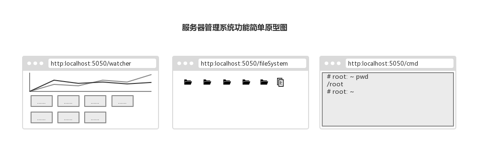

## 功能性需求总结
### 支持多平台环境
项目需要支持大部分Unix和Linux内核操作系统，能在主流系统上正常运行本项目所有功能，这要求在实现方案上选择时必须要考虑到平台兼容性的问题，以及在之后的安装过程中需要做到多系统兼容。因此我需要在后期对这些系统进行手动测试以确保系统运行的正确性。

### 用户验证
用户验证是指用户通过系统许可的用户口令进行访问带有权限的数据。简单来说就是使用密码访问，多用户系统会需要用户提供用户名。本项目中涉及到的服务器数据以及各种操作均属于隐私数据及操作，如果不进行权限验证，会把服务器暴露在非常危险的环境中，因此本项目必须对服务器的访问用户进行权限验证，这一步需要用户在登录界面提供用户名与密码。

### 系统资源数据显示
系统资源数据包括CPU的负载，系统态、用户态等时间统计百分比，内存使用率，磁盘使用率等等，以及各个数据的统计特征数据等等。这个需求主要满足用户群体在系统运行维护时的要求，数据的采集和显示需要后端和前端支持，并且数据的存储需要数据库的支持。数据展示页面需要进行合理设计，确保界面干净整洁，相似界面风格统一，数据展示风格合理。

### 文件操作管理
刚刚入门服务器运行维护的用户最大的使用障碍就是服务器的字符终端界面操作并且用户在服务器上最主要的操作实际上就是对文件的操作，包括新建、删除、查看、修改、移动等。因此为文件提供了相关的图形界面操作实际上会大大减小用户从图形操作系统到命令行操作系统的过渡障碍，从而让绝大多数人都能轻松进行服务器的管理。

### 命令执行
服务器维护主要操作为文件的查看、相关命令的执行等等，文件操作已经列为功能性需求那么如果能提供命令在线执行功能的话那么用户日常维护的所有需求就都能得到满足。但是由于web的限制，因此最好能对命令进行限制或者是命令运行的环境进行限制。

### 代码运行
这个需求主要是面向服务器管理入门用户群体，这部分群体往往是个人开发者，因此会有在服务器上进行简单开发的需求，所以这里把代码运行也作为功能性需求。代码运行会在一个安全的沙盒环境中进行，并且暂时只支持部分语言，不过这里可以通过配置由用户自己添加语言，所以这个不会成为功能上的限制。

## 非功能性需求总结
### 高内聚低耦合架构设计
本项目涉及到的功能点并不能满足所有的服务器运行维护用户群体的需求，并且作为个人开发项目，其中的很多功能并不能达到线上环境的使用要求，因此实际上我并没有期待项目能直接投入生产，而是希望能够通过合理的架构设计，让模块的功能聚合程度更高，模块化设计让模块之间的耦合程度更低，合理的接口设计让后期的功能扩展更加便利。这样可以让本项目在更多人的手中获得二次开发，从而能够让项目迅速成长。

### 更少的依赖和更小的系统占用
本课题定位于系统运行维护，因此在实际运行时，如果项目本身就占据了大量的系统资源，对于用户来说这是非常难以接受的，因此在开发本项目时的一个主要思想就是使用更少的依赖和更小的系统占用。这在之后的实现方案中有具体体现。在开发语言、实现模块、数据库模块等等的选择上必须立足于更少、更小的出发点去选择，并在项目完成之后能够通过测试获得程序运行实际的系统占用数据，从而让用户能够清晰地了解自己的服务器是否能够承担这一部分损耗。

### 完整的系统测试
测试是一个系统能够正常运行的保证，没有经过测试的代码是不能被信任的，合理的测试环节能够减少开发维护和重构优化成本，并且能够让开发者能够在短时间内确定修改对系统造成的影响。单元测试可以保证系统的每一行代码都是在预期都运行的，功能测试可以确保整个软件的功能是正常和完整的。

### 用户安装辅助
为了让用户能够快速尝试本项目，提供安装脚本以辅助用户进行安装，将系统使用到的依赖以及安装配置全部放在脚本中进行，用户不必要关心具体安装细节即可在短短几分钟内安装并体验本项目。

# 第四章 系统可行性分析
## 技术实现可行性分析
### 系统数据监控实现可行性
后端开发语言选择Python，数据库选择sqlite。并且根据功能需求设计，项目要求可以跨平台运行，这意味着，我需要在主流Unix或者Linux系统上正常运行程序，因此选择一个跨平台的系统数据监控方案非常重要。这里根据我对类似项目进行调查我选择python的psutil库作为数据采集功能实现的工具。psutil支持python2和python3，由于python的跨平台兼容性，因此psutil在主流操作系统上都能正常运行，不过由于硬件架构的差异，部分数据可能会采集不到，不过这部分数据是我们不关心的数据，所以psutil正好能满足功能性需求。psutil是一个开源的库，可以使用多种软件包管理工具进行下载，下载过程非常简单。

### 文件管理操作实现可行性
类似在前端实现文件操作的产品我们平时也经常接触，像网盘的web客户端、proccess on等，支持更改右键菜单实现对文件对象的在线增删查改，不过需要后端进行配合。也就是说，后端提供一个数据接口，根据从传入的URI进行判断，当URL指向一个文件时，返回该文件内容，当URI指向一个文件夹时，返回文件夹下所有的文件和文件夹列表，同时提供创建文件（夹）、删除文件（夹）、修改文件（夹）接口。文件在线编辑由后端接口返回文件内容，并打开ACE编辑器插件，把文件内容设置为初始值，如果判断为代码源文件，则可以预设置代码高亮，编辑完成由保存按钮触发上传新的文件内容，调用后端接口把新的内容写入文件。由此分析，后端需要提供的几个接口有：文件（夹）查询、创建、删除、修改。前端实现右键菜单提供文件操作的几个可选项即可，可以参考市面上很多软件的实现方案，因此这个功能可以很轻松地实现。

### 代码在线运行操作实现可行性
为了实现代码在线运行，我调研了像牛客网、leetcode等知名网站实现的原理。目前有很多开源的实现方案，但是很多实现方案由于很久没有更新因此使用起来非常不方便，存在很多bug。我调研了常用的比如GateOne、shellinabox、xterm.js、webssh、webssh2等方案，都是基于web实时通讯实现的，也就是说都是基于HTML5的websocket技术实现的。HTML5标准如今已经被绝大部分浏览器所支持，所以这个功能实现也并不难。我最终选择webssh2作为本课题的实现方案，因为该项目相对于其他项目的完整性和稳定性以及用户反馈结果都比其他的方案更加好。

## 成本实现可行性分析
本项目所涉及到的所有工具和库都是开源的，都可以在互联网上免费获取其源代码和二进制文件，因此经济成本总计为零；所有的工具和库都是当下相关功能实现的主流实现方案，有非常多的学习资料、丰富的学习文档以及相关问题的解决方案等等，因此学习成本也会相对较低。

# 第五章 系统设计指导思想
### 开闭原则
开闭原则就是说对扩展开放，对修改关闭。在程序需要进行拓展的时候，不能去修改原有的代码，而是要扩展原有代码，实现一个热插拔的效果。所以一句话概括就是：为了使程序的扩展性好，易于维护和升级。想要达到这样的效果，我们需要使用接口和抽象类等。

* 单一职责原则： 不要存在多于一个导致类变更的原因，也就是说每个类应该实现单一的职责，如若不然，就应该把类拆分。
* 里氏替换原则： 任何基类可以出现的地方，子类一定可以出现。 LSP是继承复用的基石，只有当衍生类可以替换掉基类，软件单位的功能不受到影响时，基类才能真正被复用，而衍生类也能够在基类的基础上增加新的行为。里氏代换原则是对“开-闭”原则的补充。实现“开-闭”原则的关键步骤就是抽象化。而基类与子类的继承关系就是抽象化的具体实现，所以里氏代换原则是对实现抽象化的具体步骤的规范。里氏替换原则中，子类对父类的方法尽量不要重写和重载。因为父类代表了定义好的结构，通过这个规范的接口与外界交互，子类不应该随便破坏它。
* 依赖倒转原则: 这个是开闭原则的基础，具体内容：面向接口编程，依赖于抽象而不依赖于具体。写代码时用到具体类时，不与具体类交互，而与具体类的上层接口交互。
* 接口隔离原则: 这个原则的意思是：每个接口中不存在子类用不到却必须实现的方法，如果不然，就要将接口拆分。使用多个隔离的接口，比使用单个接口（多个接口方法集合到一个的接口）要好。
* 迪米特法则（最少知道原则）: 一个类对自己依赖的类知道的越少越好。也就是说无论被依赖的类多么复杂，都应该将逻辑封装在方法的内部，通过public方法提供给外部。这样当被依赖的类变化时，才能最小的影响该类。另一个表达方式是：只与直接的朋友通信。类之间只要有耦合关系，就叫朋友关系。耦合分为依赖、关联、聚合、组合等。我们称出现为成员变量、方法参数、方法返回值中的类为直接朋友。局部变量、临时变量则不是直接的朋友。我们要求陌生的类不要作为局部变量出现在类中。
* 合成复用原则: 原则是尽量首先使用合成/聚合的方式，而不是使用继承。

### 更少&更小
立足于更少的模块依赖、更小的系统占用思想，选择合适并且合理的依赖和库进行开发，保证环境的干净整洁，以兼容更多的设备和环境。

# 第六章 系统设计
## 系统结构
本课题是一个完整的web项目，因此需要前后端配合，采用B/S架构可以统一用户端访问的方式。传统C/S架构需要开发多端应用，兼容常见的iOS/Android/Windows/MacOS等系统，因此开发难度相对会比较困难。使用B/S架构，用户只需要安装一款主流的浏览器，通过浏览器访问服务器即可。

本课题在采用B/S架构的前提下，采用前后端分离策略，即前端只专注于视图部分的设计，使用Vue.js、Element.js和eChart.js等前端框架和插件库，设计界面精美等页面和组件，以提供良好的用户体验。后端部分的API模块专注于提供模型数据，即通过HTTP API接口提供数据供前端获取。  
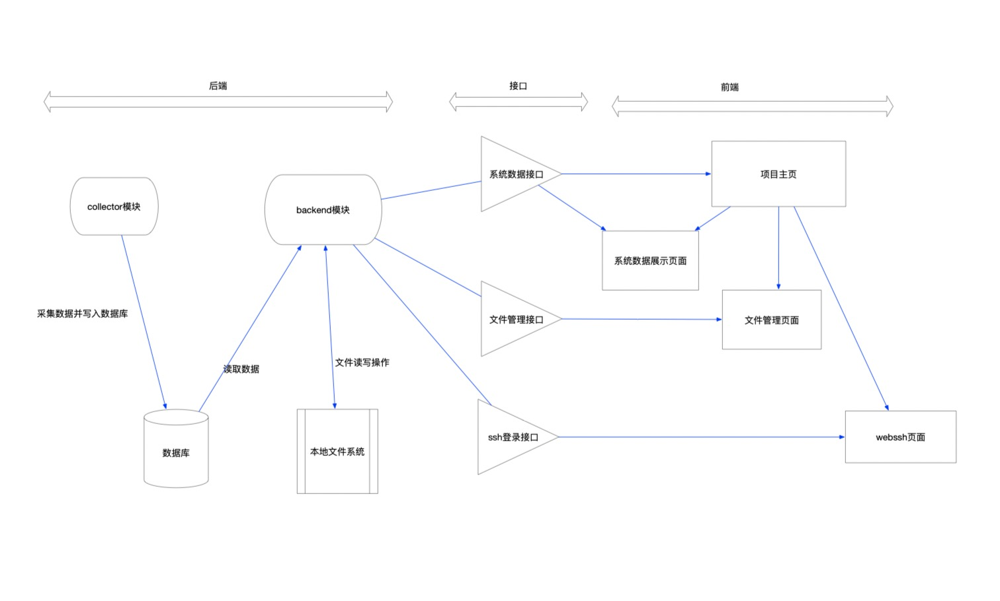  

前端模块框架采用Vue.js，组织架构采用组件化设计，需要实现三个功能模块，如图所示的系统数据展示页面、文件管理页面和webssh页面，另外需要设计项目主页作为前端页面入口，以及登录界面。

后端API模块接口部分由swagger文档描述，使用flask_restplus生成API模块的描述文档，采用模块化的设计，把API分成多个模块的集合，使得每个模块内的数据接口抽象为RESTful的操作，模块主worker对象集成各个子模块的API，并初始化全局对象和启动/停止模块运行。使用面向对象的模块化设计，使代码符合高内聚、低耦合原则，当需要对接口进行重构和优化时，可以在保证其他模块功能不受影响的前提下进行局部优化，配合完善的单元测试、功能测试，这可以大大减轻后期重构优化的成本。

后端部分需要实现数据采集collector、数据库和后端API接口模块。collector模块负责数据采集功能，所有需要进行采集的数据都需要注册到collector中进行管理。数据库使用sqlite进行开发，使用初始化脚本进行数据表创建和检查。后端API模块使用flask框架，使用蓝图使模块隔离，减少后期维护升级成本。

## 具体模块结构设计
### 前端页面
前端页面采用树形结构，根结点为APP页面，APP页面挂载了三个组件，分别时Header、Aside和Main，Header负责整个前端的header部分设计，该组件设计之后可以在所有页面中使用，已实现整个页面风格的统一。Aside组件负责侧边栏设计，这里负责整个页面的菜单设计，菜单项会决定Main中实际显示的内容，Main组件中包含一个router-view组件，这个组件根据Vue-router中配置的路由来决定显示的子组件内容，配合Aside菜单项可以实现单击菜单项实现页面跳转。
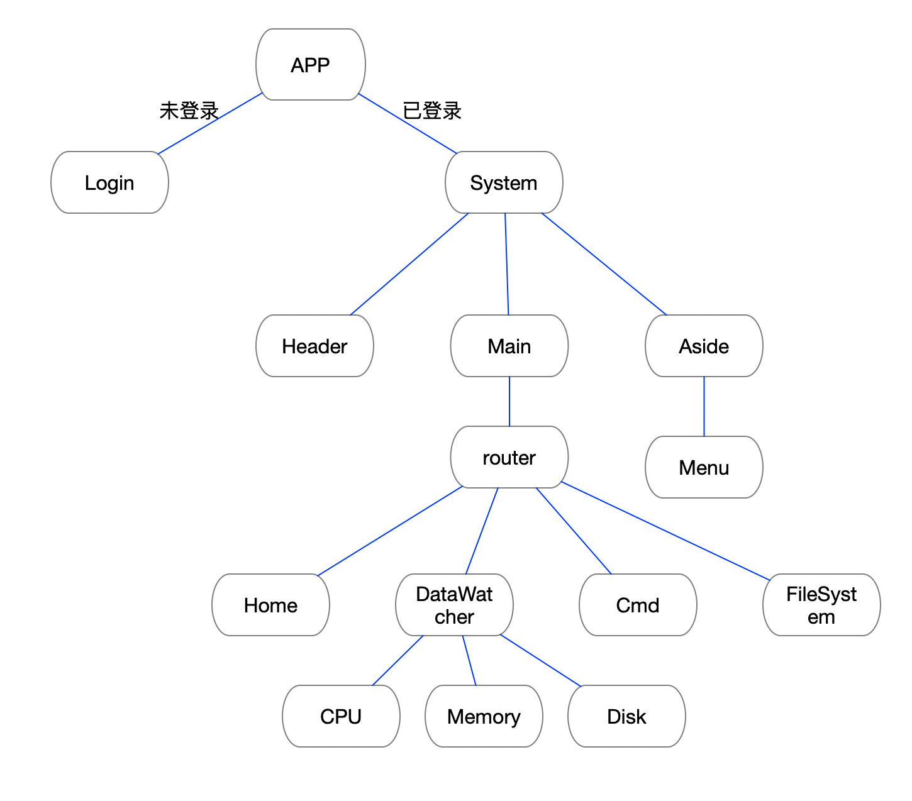

当需要设计一个新的页面时，只需要单独设计页面之后，把页面组件添加到Vue-router配置中，并在Aside中绑定对应的菜单项即可。这种模式可以把整个页面统一的部分抽离出来，以便于单独设计每个页面，当需要单独优化或者重构某个页面时，不需要更改其他部分代码，只需要修改本页面代码即可，并且不会对其他页面造成任何影响。

根据功能需求，页面主要有：项目主页面、系统数据监控页面（CPU、磁盘、内存）、文件管理页面、webssh页面。项目主页面显示服务器相关的状态信息，这里会对CPU、磁盘、内存显示一个概要数据，并且对整个项目进行一个介绍等；系统数据监控页面是一个父级菜单，其子菜单为各个监控项页面，包括CPU、磁盘、内存等，监控项根据监控对象的不同显示实时数据、某时间段内的特征值等，其中的图标都是组件化设计模块比如linechart、card等的实例对象，其设计代码在components下实现。文件管理页面是一个单独的页面，包含一个文件浏览窗口，窗口中显示目录下的文件，其初始路径由配置文件配置，默认为运行用户的主目录，右键可以选择对该文件的操作，包括增删改等，右键空白区域可以选择新建文件或文件夹。webssh页面是一个iframe，其内部是一个ssh窗口，用户可以通过ssh协议登录到部署机器上实现更多操作。前端实时数据会在APP根结点创建时请求服务器创建websocket连接，服务器会实时传输数据到浏览器上，因此当监控数据页面进行切换时不会导致数据被刷新。

### 接口设计
#### 系统数据接口
系统数据接口只需要提供数据查询接口即可，根据传入参数决定查询的数据类型，以便于后期数据类型扩展。请求方式为GET。在跨域设置中需要保证添加请求域以及请求方法以保证数据能够被正确接收。
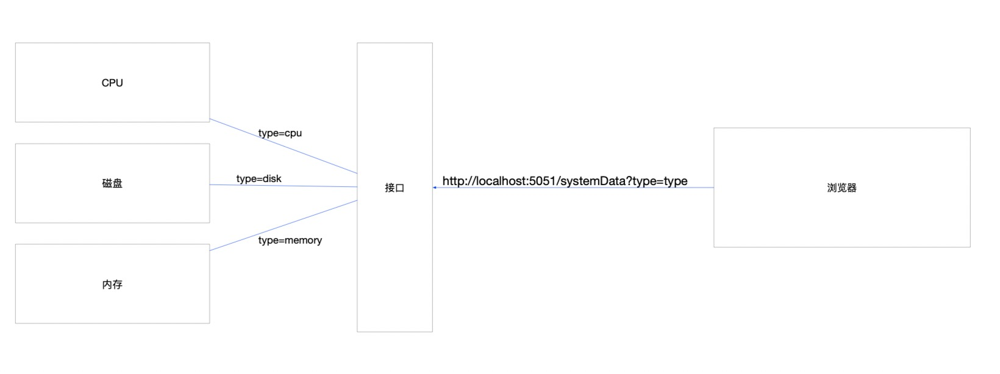  
根据请求参数中的type访问不同数据接口从而实现单个数据接口的可扩展性。数据接口在访问之后会升级为websocket连接，每一个连接会建立一个单独的线程，接口会根据当前请求时间，返回一定时间段长度内的实时数据到前端，并在连接期间实时传输新的数据，以实现前端页面数据的刷新。当新增数据类型时，在接口中增加对应type的处理函数即可，这使得扩展新数据变得非常简单，并且不会对以前的功能造成影响。

#### 文件操作接口
文件操作涉及对文件的创建、移动、修改、删除，这非常类似数据操作的CURD操作，因此我选择使用RESTful API实现这一类接口。  
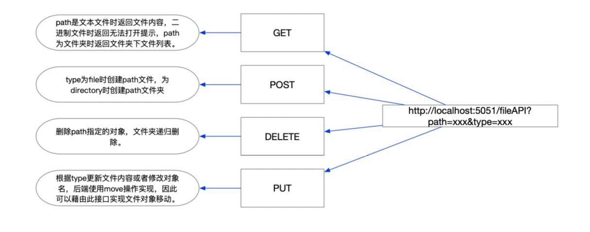  
通过对一个接口的不同请求方式进行处理，以减少接口维护成本，并且符合HTTP请求方法设计思想。请求中附带两个参数，path用于表示请求文件对象的路径，这是一个相对路径，不过对于用户来说是一个绝对路径，在后端中选择一个文件系统根目录，然后相对路径以该目录为基础进行文件对象定位；type参数用于在必要的时候指示path对象的类型或者即将执行的操作类型，文件对象类型有file和directory两种，操作类型有update和move两种。  
GET请求会返回文件夹下文件对象列表或者返回文本文件的内容；当type为directory时，请求访问一个文件夹下的文件对象列表，后端会获取对应路径下的全部文件对象，如果请求路径不是根路径，会在返回结果中添加一个'..'文件对象，其指向上一层目录，如果用户不具有该文件夹的访问权限，会返回403表示没有权限，另外如果请求路径被指向了根目录上层，会返回404表示没有找到；当type为file时，如果请求文件是一个二进制文件，包括图片、视频、数据库文件等等，会返回一个406表示数据无法被获取，如果是文本文件则会返回文件内容，前端可以实现数据展示以及修改。  
POST请求用于创建文件对象，当type为file时，使用0666权限创建一个新的文件，当type为directory时使用0666创建一个新的文件夹，不支持递归创建，因此当创建路径不存在时会返回400错误码。创建文件只支持创建文本文件。  
PUT请求用于更新内容；当type为update时，表示更新文本文件的内容，此时需要检查path是否是一个文本文件以保证接口没有被误调用，当检查到path指向一个二进制文件时，那么此次更新操作不被允许，返回400状态码，当path指向一个文本文件时，写入新的文件内容。当type为move时，表示对文件对象执行move操作，PUT数据中包含新的path路径，由于后端使用move操作实现，因此该操作也可以实现文件对象名称修改。  
DELETE请求用于删除文件对象，这个操作实际上不关心文件对象的类型，因此type参数是可选的，当path指向文件时，后端会删掉文件，当path指向文件夹时后端递归删掉文件夹及其内容。  

### 后端API模块设计
后端API模块提供前端数据交互接口，采用flask蓝图将各个子模块进行隔离，从而实现模块之间的独立性。  
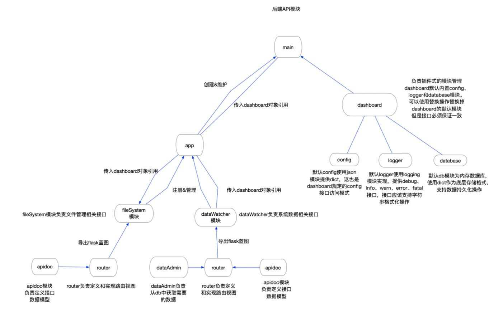  
main主进程负责创建dashboard对象和app对象，app对象创建需要dashboard对象引用作为参数，dashboard对象维护config、logger和database等全局对象，app内部模块通过dashboard对象访问全局对象。app模块是后端API模块的功能模块，其实现了所有子模块的聚合；flask使用蓝图来命名具有独立业务能力的子模块，也就是fileSystem和dataWatcher两个模块，两个模块互相独立，可以在对方不受干扰的情况下进行独立的升级和注销，同时这种方式也有利于增加新的子模块。  
为了统一每一个蓝图内的结构以便于维护，每一个蓝图的路由处理函数都定义在router内，apidoc使用flask_restplus定义和维护所有的数据模型，以便于自动生成swagger文档，dataAdmin中实现实际数据到数据库对象的封装，以便于数据能够得到进一步抽象，也可以在这里对数据进行适配。

### 数据库设计
数据库分为数据库模块和数据管理模块，数据库模块由调研分析选择SQLite，使用python sqlite3模块进行交互，数据管理模块则是直接于sqlite数据库直接交互的管理模块，系统数据经由database数据管理模块存入数据库中，通过封装向上层提供更加友好的接口，隐藏实际数据向SQL语句转换的过程。  
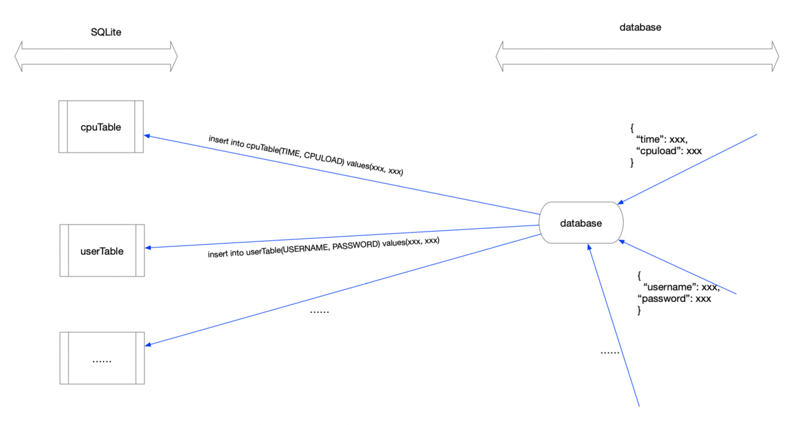  
模块插入数据时使用dict作为数据存储结构，database把dict数据转换成SQL语句再执行，隐藏了底层的转换过程，留给上层应用一个非常友好的接口。SQLite数据库中的表应该在程序运行前进行初始化保证写入的数据结构和表的结构是一致的，否则将会写入失败。  
不同数据存到不同的表中，使用时间戳作为主键，当新增监控数据类型时只需要在初始化脚本中新增一个表即可，由此可以实现非常简单的扩展并且不会影响原来的设计。如果把所有的数据都存到一张表中，可以增快查询速度，减少查询次数，但是由于不同数据写入是由不同模块负责的，因此需要进行数据同步，这回影响到数据的写入速率并且不利于数据扩展，当需要重新添加数据类型时，表格需要扩展列，这对于原数据会造成影响，所以这里选择把不同的数据存到不同的表中。

### 数据采集模块设计
数据采集模块采用抽象管理模式，基类定义collector和workerBase对象，其实现如下：  
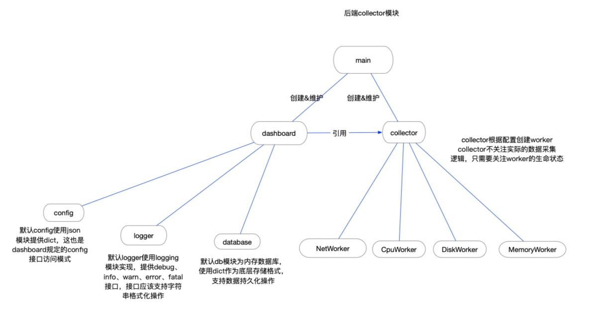  
collector对象由采集模块主进程创建和管理，执行dispatch方法之后，collector根据配置文件，创建workerBase的派生类实例，并创建子进程执行workerBase的run方法，执行完成之后调用watch方法进入监视状态，collector定时轮循获取每一个worker的运行状态，当一个worker出现异常时，collector会创建一个新的进程和一个新的对象，然后结束异常进程。当collector收到退出信号时，通过向worker发送退出信号，等待每一个worker都退出之后，结束主进程。采集模块主进程负责读取配置文件，创建dashboard对象和collector对象，collector对象需要引用dashboard因此创建collector之前需要严格确认dashboard状态。创建完collector对象之后，执行collector对象dispatch方法后，进入监视状态，主进程捕获终端的SIGINT和SIGQUIT信号作为退出信号，当捕获到这两个信号之一时，通知collector对象退出，等待收到退出成功信息之后，再通知dashboard对象退出，最后打印日志退出。

## 关键技术分析
### Web
web全称是全球广域网，也叫做万维网，是一种基于超文本和HTTP的、全球性的、动态交互的、跨平台的分布式图形信息系统。简单来说，用户可以使用浏览器浏览全世界互联网web服务器上的资源，这极大促进了文化和资源的传播速度，缩小了世界的范围，使用户足不出户就可以了解到世界各地发生的事情。不过对于我们来说，这意味着我们只需要把产品放在web服务器上并接入互联网，那么世界各地的用户都可以使用这个产品。

### 面向对象的设计模式之工厂模式
工厂模式在Java中非常常见，是我们在创建对象中非常常用的实例化对象方法。简单来说工厂模式封装了一类相似对象的创建过程，作为调用者只需要告诉工厂自己需要创建一个什么样的对象即可。如果不采用工厂模式，那么对于用户来说需要面对众多的对象以及不一样的构造方式，这个接口对于用户来说是非常不友好的，因为这增加了用户对模块的使用成本；如果这一系列的对象由开发者自己维护，那么如果后期需要修改某一个对象的构造方式，那么需要修改整个项目中所有构建该对象的地方，这又增加了对象的维护成本。因此通过抽象工厂类，向用户隐藏了对象的构造方式，从而实现一个非常友好的用户接口，极大减少了用户对模块的使用成本，还能减少对象的维护成本，如果后期需要修改构造方式，那么只需要修改对象的构造函数以及工厂对象的对象构造方法即可。
TODO：工厂模式示意图

### 面向对象的设计模式之单例模式
在后端模块中的dashboard、logger和conf等对象需要在整个项目中保持唯一，也就是说除了创建和管理这些对象的模块之外其他模块只能够获取这些对象的引用，这个需要在设计上采取一定的技巧从而实现该功能。节约系统资源，当 需要频繁创建和销毁的对象时单例模式无疑可以提高系统的性能，另外也可以保证多个模块之间数据和状态的同步问题，如果所有对象都引用自一个根对象，那么对这个根对象的修改就可以体现在所有引用了该对象的地方。另外，像conf这样的保存配置数据对象，我只希望创建和管理该对象的模块拥有修改权限，而其他引用对象不具有修改权限，只有读取权限，那么通过在创建引用时进行限制就可以实现通过引用对象无法修改对象内部状态的功能。但是需要注意的是像database这类对象并不适合于使用单例模式，如果整个系统都只维护一个数据库管理对象，那么所有的数据写入都需要调用该对象方法，这会导致数据库连接池维护太多连接出现错误。本项目使用SQLite作为数据库存储，而SQLite不支持数据库连接的跨线程使用，因此database也不应该被实现为单例模式。

### websocket
Websocket是HTML5开始提供的一种在单个TCP连接上进行全双工通讯的协议。HTML5规范在2014年10月29日制定完成。Websocket允许一个建立HTTP连接的双方可以互相推送数据，这意味着不仅仅可以从客户端发送请求数据到服务端，也可以从服务端主动推送数据到客户端，这打破了服务端只能被动处理请求的传统，让一些对数据有实时性要求的app开发变得更加轻松。以往在没有websocket的时候，为了实现这种实时数据传输，往往会在页面上创建一个定时器用于循环请求服务端数据，这对于页面来说压力过大，特别是定时器在没有正常销毁的时候，多次设定定时器很可能会导致页面卡死。在有了websocket之后，这一切都不是问题，这意味着在web上实现多人在线实时聊天、实时游戏等等成为了可能。websocket必须由浏览器提供支持，所幸现在HTML5已经被绝大部分浏览器支持，在使用的时候，必须还必须前后端配合。浏览器通过javascript向服务器发起websocket连接的请求之后，服务器响应连接，连接成功之后客户端和服务器就可以通过这个连接互相推送数据。客户端通过send()方法向服务器发送数据，并通过onmessage事件来接收服务器返回的数据。

### RESTflu API
REST全称是表述性状态转移，指的是一组架构约束条件和原则，当一组接口满足这些约束条件和原则的应用程序或设计就是 RESTful的应用接口。简单来说，万维网使用URL标示网络资源，每一个资源都有其独特的URL，URI用于在一个指定的服务器上获取一个特定的资源，对一个URI的处理可以通过一个接口的不同请求方式来完成，HTTP协议有多种请求方式，常用的GET、POST、DELETE和PUT刚好可以用来完成资源的CURD相关操作，使用这种方式来定义一组接口可以简化接口定义。

## 相关工具介绍
### Vue.js
Vue是一套用于构建用户界面的渐进式框架。Vue读音类似于View，并且Vue核心库专注于图层，通过数据与模型的双向绑定，可以很简单地实现视图的更新，同时Vue本身语法规则非常简单，结合丰富地第三方框架，对于开发小型的单页应用其开发成本非常低，并且开发速度也非常快。使用Vue提供的脚手架工具，只需要安装Node.js环境即可在短短几分钟内完成基础环境的搭建。本项目涉及大量数据展示需求，因此选用核心模型与视图双向绑定的框架，有利于加快视图渲染，提高用户体验。

### Element.js
Element.js是一套为开发者、设计师和产品经理准备的基于Vue2.0的桌面端组件库，其默认提供了一套前端组件例如按钮、输入框、复选框、侧栏菜单、下拉菜单等等，使用用户非常亲睐的扁平化风格，不需要额外低样式设置即可使用，另外也支持自定义主题。本项目选用Element作为基础组件库，力求减少开发成本，提高用户体验，使用统一风格加强界面视觉效果。Element支持使用CDN在页面上引入，也支持下载到本地使用，引入时支持全引入和部分引入，用户可以根据应该对性能的要求选择最适合自己的方式进行引入。

### Echart.js
Echart.js是一个使用Javascript实现的开源数据可视化库，可以流畅低运行在PC和移动设备上，并且其兼容当前绝大部分浏览器。当前也在不断更新以增加新功能以及优化性能，底层采用轻量级的矢量图形库ZRender，提供非常直观、交互丰富并且可高度定制的数据可视化图表。本项目系统监控模块部分前端需要展示大量数据图表，因此采用Echart.js作为数据展示的库，在配置好数据的展示方式之后，我只需要关注数据的来源即可，不需要去关注数据如何呈现。Echart.js同时也支持多端适配，这样在之后本项目考虑适配多端设备时也可以非常方便地进行重构。

### 富文本编辑器插件Ace Editor
Ace是一个实现了语法高亮功能的前端文本编辑器，默认内置了大量的功能包括代码提示功能和大量主题风格，Ace支持作为Vue插件进行引入，并且有丰富地API进行扩展。包括设置内容只读、设置代码折叠、设置自适应大小、内容检索等等，甚至可以根据用户使用习惯扩展vim操作模式；本项目需要在前端实现文本内容编辑功能，并且由于用户群体包括开发人员，因此需要支持代码文件的友好展示，代码高亮是必须具备的功能。

### SQLite
SQLite是一款轻量级的数据库，遵循关系型数据库ACID原则，使用C语言开发，该项目为嵌入式设备设计，这意味着它对性能的要求是非常低地，同时它支持Windows/Linux/Unix多种主流操作系统，并且提供相当多地SDK支持。SQLite支持数据库事务，无需安装和管理配置，持久化存储数据库的数据全部存储在一个文件中，数据库文件还可以在不同字节序地机器之间进行共享，因此SQLite数据库数据可以很轻易进行备份和分享；支持最大2TB级别的数据存储，并且支持内存数据库。本项目使用SQLite作为存储工具的原因有以下几点：首先是减少依赖，本项目最终目标是用户安装即可使用，默认不需要用户进行配置，对于MYSQL、Redis、MangoDB等需要用户进行手动配置的方案不予采用，本项目不涉及权限管理的需求，因此使用商业级别数据存储方案是大材小用的；另外由于本项目可能会运行在一些非常极端的嵌入式设备中，因此对于性能和资源的消耗也是必须要考虑的，SQLite使用C开发，其性能是非常优秀的，并且由于设计目标就是嵌入式设备，因此其资源消耗也很低。

### Flask
Flask作为server框架的原因是flask是一个功能齐全并且非常轻量级的框架，相比较于Djiango和Tornado，flask没有集成丰富的解决方案，这让他本身显得非常整洁和轻量，在一些需要复杂的业务逻辑场景中，这是flask的缺陷，但是在本项目中，由于没有复杂且大量的请求和数据库操作，flask的功能和性能刚好能够满足需求。flask也有非常丰富的使用案例以及详细的用户手册，不需要花费大量时间去学习即可掌握，环境搭建成本也非常小。

### Flask_restplus
Flask 是一个以自由度高、灵活性强著称的 Python Web 框架。但高灵活性也意味着无尽的代码维护成本、高自由度意味着代码质量更依赖程序员自身而没有一致的标准和规范。因此团队内开发时 Flask 项目更需要建立代码和文档规范以保证不会出现太大的偏差。对于REST Api来说，Flask-RESTPlus是一个优秀的Api文档生成工具，这个包将会替换Flask路由层的编写方式，通过自己的语法来规定Api细节，并生成Api文档。Swagger是一款非常流行的Api文档管理、交互工具，适用于在团队中的Api管理，以及服务组件对接。使用Flask_restplus可以根据代码直接生成swagger.json文档，并提供一个路由用于提供访问接口。

#第七章 系统代码实现以及实现结果
## 数据库
根据模型设计数据库初始化脚本代码如下：
```sql
CREATE TABLE IF NOT EXISTS cpuTable (
    TIMESTAMP       INTEGER     PRIMARY KEY     NOT NULL,
    LOGICALCNT      INTEGER                     NOT NULL,
    PHYSICSCNT      INTEGER                     NOT NULL,
    USERATE         FLOAT                       NOT NULL,
    USERTIME        FLOAT                       NOT NULL,
    SYSTEMTIME      FLOAT                       NOT NULL,
    IDLETIME        FLOAT                       NOT NULL,
    FREQUENCY       INTEGER                     NOT NULL
);
CREATE TABLE IF NOT EXISTS memoryTable (
    TIMESTAMP       INTEGER     PRIMARY KEY     NOT NULL,
    MEMORYTOTAL     INTEGER                     NOT NULL,
    MEMORYUSERATE   FLOAT                       NOT NULL,
    SWAPTOTAL       INTEGER                     NOT NULL,
    SWAPUSERATE     FLOAT                       NOT NULL,
    SWAPSIN         INTEGER                     NOT NULL,
    SWAPSOUT        INTEGER                     NOT NULL
);
CREATE TABLE IF NOT EXISTS diskTable (
    TIMESTAMP       INTEGER                     NOT NULL,
    DEVICENAME      TEXT                        NOT NULL,
    MOUNTPOINT      TEXT                        NOT NULL,
    FSTYPE          TEXT                        NOT NULL,
    TOTAL           INTEGER                     NOT NULL,
    USERATE         FLOAT                       NOT NULL,
    PRIMARY KEY(TIMESTAMP, DEVICENAME)
);
CREATE TABLE IF NOT EXISTS userTable (
    USERNAME        TEXT        PRIMARY KEY     NOT NULL,
    PASSWORD        TEXT                        NOT NULL
)
```

当SQLiteBase类创建成功时连接上数据库后执行初始化脚本，确保项目需要的数据表存在。SQLiteBase类中相关代码如下：
```python
# SQLiteBase构造函数
def __init__(self, database_path, logger=logging, init_script=None, init_script_file=None):
    self.database_path = database_path
    self.logger        = logger
    
    # 执行初始化脚本
    if init_script is not None:
        self.initDB(init_script)
    
    # 如果传入的是初始化脚本文件路径则读取文件内容后执行脚本
    if init_script_file is not None:
        try:
            f = open(init_script_file, 'r')
            init_script = f.read()
        except Exception:
            self.logger.exception(u"open script file fail.")
            raise
        self.initDB(init_script

# 初始化脚本执行函数
def initDB(self, sqls):
    """
    执行初始化脚本，执行失败时抛出错误。
    """
    conn = self.connectDB()
    
    try:
        conn.executescript(sqls)
        conn.commit()
        self.logger.info(u"database initialize successfully.")
    except:
        self.logger.exception(u"Execute initialize sql script error.")
        conn.rollback()
        raise
    finally:
        conn.close()
```
当database创建成功后，其他模块就可以通过调用database的insert、delete、select、update接口实现数据库的增删查改。

## 全局对象管理器--dashboard
dashboard是一个全局对象管理模块，类似于一个控制台一样，把需要的全局对象都交给dashboard进行维护，其他模块通过dashboard来获取其中的全局对象引用。默认全局对象有日志模块logger、配置模块config、数据库模块database，其结构设计如下：  
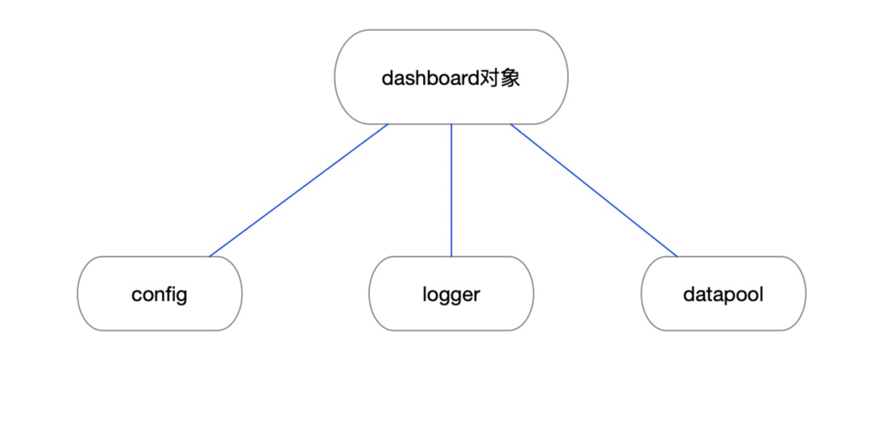  
每一个子模块都应该维护一个dashboard模块，dashboard默认有config、logger和database子模块，如果用户没有选择替换这些默认对象，那么可以选择使用dashboard默认对象使用。默认config模块使用dict接口进行访问，当访问到不存在的配置时不会抛出异常而是返回None，这可以提高程序的鲁棒性；默认logger模块由logging模块封装，支持namespace以实现多模块管理；默认database使用内存存储，使用dict实现，支持数据持久化。同时用户也可以通过继承实现自己的插件并注册到dashboard中。
```python
class Logger:
    _default_conf = {
        "version": 1,
        "disable_existing_loggers": False,
        "formatters": {
            "default": {
                "format": "[%(asctime)s][%(name)s][%(levelname)s][%(filename)s:%(lineno)d]: %(message)s",
                "datefmt": "%d-%M-%Y %H:%M:%S"
            }
        },
        "handlers": {
            "defaultHandler": {
                "class":"logging.StreamHandler",
                "level":"DEBUG",
                "formatter":"default",
                "stream":"ext://sys.stdout"
            }
        },
        "root": {
            "level": "DEBUG",
            "handlers": ['defaultHandler']
        }
    }
    _current_conf = None
    _logger = None
    _register_loggers = ['root']

    def __init__(self, conf=None):
        if not getattr(conf, 'get'):
            raise TypeError("conf has no get method")
        self._current_conf = self._default_conf
        if conf is not None:
            self._current_conf['formatters'].update(conf.get('formatters', {}))
            self._current_conf['handlers'].update(conf.get('handlers', {}))
            self._current_conf['loggers'] = conf.get('loggers', {})

        #set default propagate = 0
        for logger in self._current_conf['loggers'].values():
            logger['propagate'] = 0

        try:
            logging.config.dictConfig(self._current_conf)
        except ValueError:
            self._current_conf = self._default_conf
            logging.config.dictConfig(self._current_conf)
            logging.getLogger("defaultLogger").exception("logger config error.")
        finally:
            self._logger = logging.getLogger("defaultLogger")

        for key in self._current_conf.get('loggers', {}).keys():
            self._register_loggers.append(key)

    def getLogger(self, name):
        if name == "root":
            return self._logger

        if name in self._register_loggers:
            return logging.getLogger(name)
        else:
            raise NameError("No this logger: {}".format(name))
```
logger模块根据配置文件创建handler，然后通过getLogger方法获取logger对象，所以可以实现不通的子模块注册不同的logger达到日志细粒度控制，同时系统结构也会更加清晰。默认的配置可以让用户在简单应用中无需使用配置即可使用日志模块，降低使用难度。

```python
class Datapool:
    def __init__(self, persistence=False, filename=None):
        if persistence and not filename:
            raise ValueError("no filename set")

        self._persistence = persistence
        self._persistence_filename = filename
        self._pool = {}

    def _include(target, conditions):
        for key in conditions.keys():
            if not target.has_key(key) or target[key] != conditions[key]:
                return False
        return True

    def insert(self, namespace, record):
        if type(record) != dict:
            raise TypeError("invalid record type: {}".format(str(type(record))))

        if not self._pool.has_key(namespace):
            self._pool[namespace] = []

        self._pool[namespace].append(record)
        return True

    def delete(self, namespace, conditions):
        if type(conditions) != dict:
            raise TypeError("invalid conditions type: {}".format(str(type(conditions))))

        if not self._pool.has_key(namespace):
            return True
        
        for x in xrange(0, len(self._pool[namespace])):
            if self._include(self._pool[namespace], conditions):
                del self._pool[namespace][x]
```
Datapool类定义内存数据存储对象，内部维护一个dict作为存储结构，在存储数据量较小的模块中可以使用这个对象，但是在存储结构较大的模块中建议自定义存储模块。

```python
class Config:
    _config = {}
    def __init__(self, conf):
        """
        conf is a dict
        """
        if conf is not None:
            self._config = conf
    
    def __getattr__(self, name):
        return self._config.get(name, None)

    def __setattr__(self, name, value):
        self._config[name] = value
```
Config类重载python内置方法__getattr__和__setattr__以实现dict访问接口，另外也可以在这里实现更多的自定义方法。

## 数据采集
数据采集模块collector主函数代码如下：
```python
def main(conf):
    ## 创建日志工厂
    logFactory = Logger(conf['log'])
    ## 创建默认数据库插件
    db = SQLiteBase(conf['database']['path'], logger=logFactory.getLogger('database') ,init_script_file=conf['database'].get('init_script_file'))
    ## 创建默认配置文件插件
    config = conf['config']

    ## dashboard配置
    dashboard_init = {
        'namespace': {
            'collector': {
                'config': config.get('collector'),
                'logger': logFactory.getLogger('collector'),
                'database': None
            },
            'cpuWorker': {
                'config': config.get('cpuWorker'),
                'logger': logFactory.getLogger('cpuWorker'),
                'database': db
            },
            'memoryWorker': {
                'config': config.get('memoryWorker'),
                'logger': logFactory.getLogger('memoryWorker'),
                'database': db
            },
            'diskWorker': {
                'config': config.get('diskWorker'),
                'logger': logFactory.getLogger('diskWorker'),
                'database': db
            }
        }
    }
    ## 创建dashboard
    dashboard = Dashboard(dashboard_init)

    ## 创建collector
    collector = Collector(dashboard)

    ## 注册捕获信号
    def exitHandler(signum, frame):
        collector.exit()
        logFactory.getLogger('root').info('collector exit.')
        exit()
    signal.signal(signal.SIGINT, exitHandler)
    signal.signal(signal.SIGTERM, exitHandler)
    signal.signal(signal.SIGTSTP, exitHandler)

    logFactory.getLogger('root').info('collector start.')
    ## 启动collector
    collector.work()
```
main函数是数据采集模块的入口，需要一个conf参数，conf应该是一个dict的实例对象，然后根据conf配置创建出日志工厂logFactory、数据库对象db和子模块配置对象config，然后使用这三个对象生成dashboard配置并创建dashboard对象，由此全局对象管理dashboard创建完毕，然后创建collector对象，在启动collector之前，注册linux终端信号捕获处理函数exitHandler，捕获父进程的退出信号，然后执行collector的exit方式实现collector的从容退出；信号捕获处理函数注册完成之后，执行collector的work方法启动数据采集。数据采集collector类实现如下:
```python
class Collector:
    _dashboard = None
    _workers = []
    _check_time_interval = 10
    def __init__(self, dashboard):
        self._name = 'collector'
        logger = dashboard.getLogger(self._name)
        
        self._dashboard = dashboard
        logger.info("collector is created.")

    def dispatch(self):
        config = self._dashboard.getConfig(self._name)
        logger = self._dashboard.getLogger(self._name)
        workers = config.get('workers', [])
        for workerConf in workers:
            worker = factory(workerConf['name'], self._dashboard, workerConf.get('mode', 'threading'))
            logger.info("dispatch {}.".format(workerConf['name']))
            self._workers.append(worker)
        
        for worker in self._workers:
            worker.work()
        logger.info("All worker is running.")

    def work(self):
        logger = self._dashboard.getLogger(self._name)
        self.dispatch()

        self._running = True
        while self._running:
            for index in xrange(len(self._workers)):
                worker = self._workers[index]
                if not worker.isOK():
                    newWorker = factory(worker._name, self._dashboard, worker._work_mode)
                    worker.exit()
                    newWorker.work()
                    self._workers[index] = newWorker
                    logger.info("{} is restart.".format(newWorker._name))
            time.sleep(self._check_time_interval)

    def exit(self, force=False):
        logger = self._dashboard.getLogger(self._name)
        self._running = False
        for worker in self._workers:
            worker.exit()
        logger.info("All workers is stop working.")
        return True
```
创建完成后调用work函数启动数据采集，work函数会首先调用dispatch函数执行worker的创建函数，dispatch函数根据dashboard中的config配置，读取其中的works配置项，根据workers配置项调用worker工厂函数创建worker，并放在collector的worker管理列表中，创建完成之后，遍历worker管理列表并启动每一个worker；执行完dispatch之后返回work方法中，进入监视模式，collector的_running属性用于设置监视模式，因此在exit方法中将_running设置为False之后collector会退出监视模式；监视模式会遍历worker列表，检查worker的状态，当某个worker出现异常时，根据worker配置重新创建新的worker并替换掉异常worker。进程接收到终端的退出信号之后，执行collector的exit方法，exit会退出collector的监视模式，并遍历worker列表调用每一个worker的exit方法实现worker的从容退出。从容退出可能会因为数据正在处理导致无法立即结束进程，但是可以保证数据的完整性，因此在线上环境建议调用exit方法实现collector的从容退出模式。
  
worker由工厂函数factory创建，使用简单工厂模式创建不同的worker，每一个worker都继承WorkerBase基类，factory定义如下：
```python
def factory(name, dashboard, mode="threading"):
    if name == "cpuWorker":
        return worker.CPUWorker(dashboard, mode)
    elif name == "memoryWorker":
        return worker.MemoryWorker(dashboard, mode)
    elif name == "diskWorker":
        return worker.DiskWorker(dashboard, mode)
    else:
        return None
```
当前实现了三种数据采集worker，分别采集CPU、内存和磁盘数据，因此在factory中定义了创建这三种worker的方法，通过传入不通的name即可创建不同的worker，因此可以实现worker的创建过程配置化；WorkerBase的定义如下：
```python
class WorkerBase(object):
    def __init__(self, mode="proccessing"):
        if mode not in ['threading', 'proccessing']:
            raise ValueError("Bad mode.")
        self._work_mode = mode

    def work(self):
        if self._work_mode == "threading":
            self._running = True
            self._worker = threading.Thread(target=self.run, args=(self._work_mode, self._running,))
            self._worker.setDaemon(True)
        else:
            self._running = Event()
            self._worker = Process(target=self.run, args=(self._work_mode, self._running,))
            self._worker.daemon = True
            self._running.set()
        self._worker.start()

    def exit(self, force=False):
        if self._work_mode == "threading":
            self._running = False
        else:
            self._running.clear()
        if self.isOK():
            self._worker.join()
        return True

    def beforeWork(self):
        pass

    def afterWork(self):
        pass

    def run(self, mode, status):
        self.beforeWork()
        if mode == "threading":
            while self._running:
                self.main()
        else:
            while status.is_set():
                self.main()
        self.afterWork()

    def main(self):
        print time.strftime("%H:%M:%S", time.localtime(int(time.time()))),  "I'm working..."
        time.sleep(1)

    def isOK(self):
        if self._work_mode == "threading":
            return self._worker.isAlive()
        else:
            return self._worker.is_alive()
```
WorkerBase构造函数需要参数mode，mode有两种选择threading和proccrssing，分别表示worker是以单线程模式启动还是单进程模式启动，虽然在调研时分析worker最佳场景是以进程模式启动，但是这里还是给用户进行自定义的选项，可以通过传入mode选择以单线程模式启动worker；worker创建完成之后调用work方法，work方法根据mode选择创建进程或者线程，执行worker本身的run方法，run方法需要mode参数和status参数，因为在进程模式下进程间无法直接传递信息因此需要在进程创建时传递这两个参数，mode是运行模式，status是worker的运行状态，在线程模式下status是一个Bool值，为True时会一直采集数据，为False时会退出采集状态，在进程模式下是一个Event对象，Event对象用于在进程间进行通信；run方法在执行采集函数之前会执行beforeWork方法，采集函数退出后会执行afterWork方法，因此可以在字类中重载这两个方法实现在采集之前和采集之后的环境处理，main方法是采集函数的主要实现位置，因此派生类在继承了WorkerBase之后需要实现worker自身的数据采集逻辑，即重载main函数。以CPUWorker的main方法为例：
```python
def main(self):
    # 逻辑核
    logical_cnt = psutil.cpu_count(logical=True)
    # 物理核
    physics_cnt = psutil.cpu_count(logical=False)
    # CPU实时使用率
    cpu_current_use_rate = psutil.cpu_percent()
    # CPU类型时百分比统计
    typeT = psutil.cpu_times_percent()
    cpu_user_time = typeT.user      # 用户时
    cpu_system_time = typeT.system  # 系统时
    cpu_idle_time = typeT.idle      # 空闲时
    # CPU频率统计
    cpu_current_freq = psutil.cpu_freq().current

    # 写入数据
    database = self._dashboard.getDatabase(self._name)
    config = self._dashboard.getConfig(self._name)
    logger = self._dashboard.getLogger(self._name)
    record = {
        'TIMESTAMP': int(time.time()),
        'LOGICALCNT': logical_cnt,
        'PHYSICSCNT': physics_cnt,
        'USERATE': cpu_current_use_rate,
        'USERTIME': cpu_user_time,
        'SYSTEMTIME': cpu_system_time,
        'IDLETIME': cpu_idle_time,
        'FREQUENCY': cpu_current_freq
    }
    if database.insert(config.get('table_name'), record):
        logger.debug('insert success.')
    else:
        logger.warn('insert fail.')
    time.sleep(self._collector_time_interval)
```
CPUWorker的main方法调用psutil库获取与CPU有关的数据，并调用dashboard对象获取database模块写入数据库中，根据config设置采集时间间隔。当需要增加新的系统采集数据时，在worker中派生出新的WorkerBase类，实现其中的main方法，并把新的worker注册到工厂函数中即可。这种模式可以使字类最大程度地简化开发成本，大大增加了代码的重用度，并且符合面向对象编程的里氏替换原则。以下提供一份collector类的配置数据：
```json
{
    "collector": {
        "workers": [
            {
                "name": "cpuWorker",
                "mode": "threading"
            },
            {
                "name": "memoryWorker",
                "mode": "threading"
            },
            {
                "name": "diskWorker",
                "mode": "threading"
            }
        ]
    }
}
```
workers是collector的worker列表，遍历后调用factory工厂函数创建worker，mode用于指定worker的运行模式。collector启动之后，将数据写到databse配置指定的数据库文件中，将日志写入到日志配置指定的日志文件中。

## 前端
### 登录页面
登录页面使用Vue.js + Element.js开发，其界面如下：  
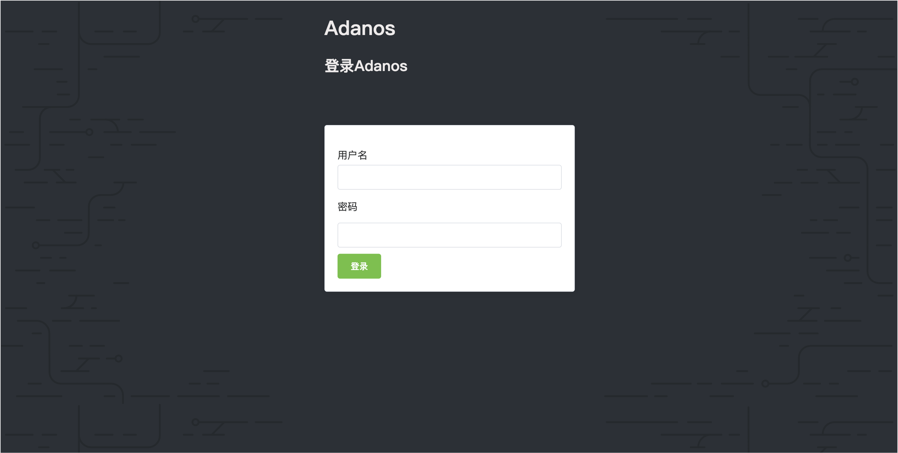  
用户输入用户名和密码之后点击登录即可进入系统；登录界面UI参考Github登录界面，其中组件使用Element.js开发，主要涉及到卡片、输入框、密码框和按钮组件，用户名输入框视图与username数据进行绑定，密码输入框与password数据进行绑定，点击登录按钮之后，调用login方法，将username和password传输到后端进行验证，验证通过后根据返回的token进入系统，token是访问后端数据的令牌，在请求后端数据时必须在HTTP的header中添加该token否则会返回403，这意味着用户可以通过伪造响应进入系统但是由于没有有效token将无法从后端获取到系统的数据。

### 系统数据获取
由于前端页面在切换之后，页面内的连接会全部断开，因此把创建和维护连接放在Aside菜单组件上，由于后端数据需要实时渲染，因此使用Vuex数据仓库保存全局数据，包括cpu、磁盘、内存等等数据，vuex创建仓库代码如下：
```javascript
import Vue from 'vue'
import Vuex from 'vuex'

Vue.use(Vuex)

const state = {
    cpu: {
        //图表数据窗口大小默认20
        win_size: 20,
        //win_size * 1.2
        win_max_size: 24,
        //进程数据窗口大小默认10
        proccess_top_cnt: 10,
        //为适应动态调整，数据实际保存数量为win_size的1.2倍
        data: [
            {'timestamp': 0, 'logical_cnt': 0, 'phycisc_cnt': 0, 'used_rate': 0.0, 'user_time_percent': 0.0, 'system_time_percent': 0.0, 'idle_time_percent': 0.0},
            {'timestamp': 0, 'logical_cnt': 0, 'phycisc_cnt': 0, 'used_rate': 0.0, 'user_time_percent': 0.0, 'system_time_percent': 0.0, 'idle_time_percent': 0.0},
            {'timestamp': 0, 'logical_cnt': 0, 'phycisc_cnt': 0, 'used_rate': 0.0, 'user_time_percent': 0.0, 'system_time_percent': 0.0, 'idle_time_percent': 0.0},
            {'timestamp': 0, 'logical_cnt': 0, 'phycisc_cnt': 0, 'used_rate': 0.0, 'user_time_percent': 0.0, 'system_time_percent': 0.0, 'idle_time_percent': 0.0},
            {'timestamp': 0, 'logical_cnt': 0, 'phycisc_cnt': 0, 'used_rate': 0.0, 'user_time_percent': 0.0, 'system_time_percent': 0.0, 'idle_time_percent': 0.0},
            {'timestamp': 0, 'logical_cnt': 0, 'phycisc_cnt': 0, 'used_rate': 0.0, 'user_time_percent': 0.0, 'system_time_percent': 0.0, 'idle_time_percent': 0.0},
            {'timestamp': 0, 'logical_cnt': 0, 'phycisc_cnt': 0, 'used_rate': 0.0, 'user_time_percent': 0.0, 'system_time_percent': 0.0, 'idle_time_percent': 0.0},
            {'timestamp': 0, 'logical_cnt': 0, 'phycisc_cnt': 0, 'used_rate': 0.0, 'user_time_percent': 0.0, 'system_time_percent': 0.0, 'idle_time_percent': 0.0},
            {'timestamp': 0, 'logical_cnt': 0, 'phycisc_cnt': 0, 'used_rate': 0.0, 'user_time_percent': 0.0, 'system_time_percent': 0.0, 'idle_time_percent': 0.0},
            {'timestamp': 0, 'logical_cnt': 0, 'phycisc_cnt': 0, 'used_rate': 0.0, 'user_time_percent': 0.0, 'system_time_percent': 0.0, 'idle_time_percent': 0.0},
            {'timestamp': 0, 'logical_cnt': 0, 'phycisc_cnt': 0, 'used_rate': 0.0, 'user_time_percent': 0.0, 'system_time_percent': 0.0, 'idle_time_percent': 0.0},
            {'timestamp': 0, 'logical_cnt': 0, 'phycisc_cnt': 0, 'used_rate': 0.0, 'user_time_percent': 0.0, 'system_time_percent': 0.0, 'idle_time_percent': 0.0},
            {'timestamp': 0, 'logical_cnt': 0, 'phycisc_cnt': 0, 'used_rate': 0.0, 'user_time_percent': 0.0, 'system_time_percent': 0.0, 'idle_time_percent': 0.0},
            {'timestamp': 0, 'logical_cnt': 0, 'phycisc_cnt': 0, 'used_rate': 0.0, 'user_time_percent': 0.0, 'system_time_percent': 0.0, 'idle_time_percent': 0.0},
            {'timestamp': 0, 'logical_cnt': 0, 'phycisc_cnt': 0, 'used_rate': 0.0, 'user_time_percent': 0.0, 'system_time_percent': 0.0, 'idle_time_percent': 0.0},
            {'timestamp': 0, 'logical_cnt': 0, 'phycisc_cnt': 0, 'used_rate': 0.0, 'user_time_percent': 0.0, 'system_time_percent': 0.0, 'idle_time_percent': 0.0},
            {'timestamp': 0, 'logical_cnt': 0, 'phycisc_cnt': 0, 'used_rate': 0.0, 'user_time_percent': 0.0, 'system_time_percent': 0.0, 'idle_time_percent': 0.0},
            {'timestamp': 0, 'logical_cnt': 0, 'phycisc_cnt': 0, 'used_rate': 0.0, 'user_time_percent': 0.0, 'system_time_percent': 0.0, 'idle_time_percent': 0.0},
            {'timestamp': 0, 'logical_cnt': 0, 'phycisc_cnt': 0, 'used_rate': 0.0, 'user_time_percent': 0.0, 'system_time_percent': 0.0, 'idle_time_percent': 0.0},
            {'timestamp': 0, 'logical_cnt': 0, 'phycisc_cnt': 0, 'used_rate': 0.0, 'user_time_percent': 0.0, 'system_time_percent': 0.0, 'idle_time_percent': 0.0}
        ]
    },
    disk: {
        //图表数据窗口大小默认20
        win_size: 20,
        //win_size * 1.2
        win_max_size: 24,
        //进程数据窗口大小默认10
        proccess_top_cnt: 10,
        //为适应动态调整，数据实际保存数量为win_size的1.2倍
        data: {}
    },
    memory: {
        //图表数据窗口大小默认20
        win_size: 20,
        //win_size * 1.2
        win_max_size: 24,
        //进程数据窗口大小默认10
        proccess_top_cnt: 10,
        //为适应动态调整，数据实际保存数量为win_size的1.2倍
        data: [
            {'timestamp': 0, 'mem_total': 0, 'mem_used_rate': 0, 'swap_total': 0, 'swap_used_rate': 0, 'swap_sin': 0, 'swap_sout': 0},
            {'timestamp': 0, 'mem_total': 0, 'mem_used_rate': 0, 'swap_total': 0, 'swap_used_rate': 0, 'swap_sin': 0, 'swap_sout': 0},
            {'timestamp': 0, 'mem_total': 0, 'mem_used_rate': 0, 'swap_total': 0, 'swap_used_rate': 0, 'swap_sin': 0, 'swap_sout': 0},
            {'timestamp': 0, 'mem_total': 0, 'mem_used_rate': 0, 'swap_total': 0, 'swap_used_rate': 0, 'swap_sin': 0, 'swap_sout': 0},
            {'timestamp': 0, 'mem_total': 0, 'mem_used_rate': 0, 'swap_total': 0, 'swap_used_rate': 0, 'swap_sin': 0, 'swap_sout': 0},
            {'timestamp': 0, 'mem_total': 0, 'mem_used_rate': 0, 'swap_total': 0, 'swap_used_rate': 0, 'swap_sin': 0, 'swap_sout': 0},
            {'timestamp': 0, 'mem_total': 0, 'mem_used_rate': 0, 'swap_total': 0, 'swap_used_rate': 0, 'swap_sin': 0, 'swap_sout': 0},
            {'timestamp': 0, 'mem_total': 0, 'mem_used_rate': 0, 'swap_total': 0, 'swap_used_rate': 0, 'swap_sin': 0, 'swap_sout': 0},
            {'timestamp': 0, 'mem_total': 0, 'mem_used_rate': 0, 'swap_total': 0, 'swap_used_rate': 0, 'swap_sin': 0, 'swap_sout': 0},
            {'timestamp': 0, 'mem_total': 0, 'mem_used_rate': 0, 'swap_total': 0, 'swap_used_rate': 0, 'swap_sin': 0, 'swap_sout': 0},
            {'timestamp': 0, 'mem_total': 0, 'mem_used_rate': 0, 'swap_total': 0, 'swap_used_rate': 0, 'swap_sin': 0, 'swap_sout': 0},
            {'timestamp': 0, 'mem_total': 0, 'mem_used_rate': 0, 'swap_total': 0, 'swap_used_rate': 0, 'swap_sin': 0, 'swap_sout': 0},
            {'timestamp': 0, 'mem_total': 0, 'mem_used_rate': 0, 'swap_total': 0, 'swap_used_rate': 0, 'swap_sin': 0, 'swap_sout': 0},
            {'timestamp': 0, 'mem_total': 0, 'mem_used_rate': 0, 'swap_total': 0, 'swap_used_rate': 0, 'swap_sin': 0, 'swap_sout': 0},
            {'timestamp': 0, 'mem_total': 0, 'mem_used_rate': 0, 'swap_total': 0, 'swap_used_rate': 0, 'swap_sin': 0, 'swap_sout': 0},
            {'timestamp': 0, 'mem_total': 0, 'mem_used_rate': 0, 'swap_total': 0, 'swap_used_rate': 0, 'swap_sin': 0, 'swap_sout': 0},
            {'timestamp': 0, 'mem_total': 0, 'mem_used_rate': 0, 'swap_total': 0, 'swap_used_rate': 0, 'swap_sin': 0, 'swap_sout': 0},
            {'timestamp': 0, 'mem_total': 0, 'mem_used_rate': 0, 'swap_total': 0, 'swap_used_rate': 0, 'swap_sin': 0, 'swap_sout': 0},
            {'timestamp': 0, 'mem_total': 0, 'mem_used_rate': 0, 'swap_total': 0, 'swap_used_rate': 0, 'swap_sin': 0, 'swap_sout': 0},
            {'timestamp': 0, 'mem_total': 0, 'mem_used_rate': 0, 'swap_total': 0, 'swap_used_rate': 0, 'swap_sin': 0, 'swap_sout': 0}
        ]
    },
    proccess: {
        //保存全部进程数据
        data: []
    }
}

const getters = {
    cpuData(state) {
        return state.cpu.data.slice(state.cpu.win_size * (-1))
    },
    diskData(state) {
        return state.disk.data.slice(state.disk.win_size * (-1))
    },
    memoryData(state) {
        return state.memory.data.slice(state.memory.win_size * (-1))
    },
    proccessCPUData(state) {
        var copyData = state.proccess.data.slice(0)
        copyData.sort((a, b) => {return b.cpu - a.cpu})
        return copyData.slice(state.cpu.proccess_top_cnt * (-1))
    }
}

const mutations = {
    updateCPUData(state, datas) {
        datas.forEach(element => {
            state.cpu.data.push(element)
            if (state.cpu.data.length > state.cpu.win_max_size) {
                state.cpu.data.shift()
            }
        });
    },
    updateDiskData(state, datas) {
        for (var device in datas) {
            if (!(device in state.disk.data)) {
                state.disk.data[device] = []
            }
            datas[device].forEach(element => {
                state.disk.data[device].push(element)
                if (state.disk.data[device].length > state.disk.win_max_size) {
                    state.disk.data[device].shift()
                }
            })
        }
    },
    updateMemoryData(state, datas) {
        datas.forEach(element => {
            state.memory.data.push(element)
            if (state.memory.data.length > state.memory.win_max_size) {
                state.memory.data.shift()
            }
        });
    },
    updateProccessData(state, datas) {
        state.proccess.data = datas
    }
}

const store = new Vuex.Store({
    state,
    getters,
    mutations
})

export default store;
```
state定义了全部全局数据，本项目定义了cpu、memory和disk三个全局数据，并且设置了初始图表数据用于填充图表，getters定义了获取全局数据的方法，因为数据有可能需要进行处理，所以可以在这里定义方法并实现数据的处理；mutations定义了数据的更新方法，调用mutations方法后可以实现Vue触发绑定数据的视图更新。

数据使用websocket与服务端实时交互，connect事件触发websocket的建立，disconnect断开连接，其主要代码被放在Aside中以免页面切换导致数据连接断开，代码如下：
```javascript
mounted() {
    this.$socket.emit('connect')
  },
  sockets: {
    onNewData(data) {
      console.log(data)
      if (data.cpu.length != 0) {
        this.$store.commit('updateCPUData', data.cpu)
      }
    }
  },
  destroyed() {
    this.$socket.emit('disconnect')
  }
```
页面创建时Vue调用mounted方法，此时向后端发送connect事件，建立连接，sockets中监听onNewData事件，并根据data更新vuex中的全局数据，当页面退出时，发送disconnect事件断开连接。数据显示页面通过把图表和vuex数据进行绑定实现视图的实时更新，图表主要以卡片和折线图显示，卡片组件由Element.js的卡片组件封装，折线图使用Echarts.js封装，card的代码如下：
```html
<el-card  class="card" shadow="hover">
        <div slot="header">
            <span class="card-title">{{ title }}</span>
        </div>
        <div>
            <span class="card-value">{{ value }}</span>
        </div>
    </el-card>
```
其中title是卡片标题，value显示卡片内容，卡片UI界面如下：  
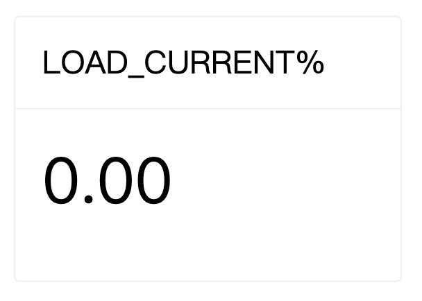  
折线图组件UI界面如下所示:
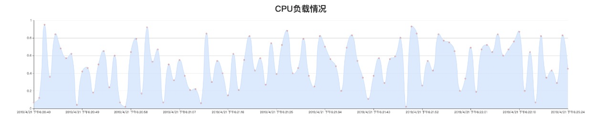
CPU数据展示页面UI界面如下所示：
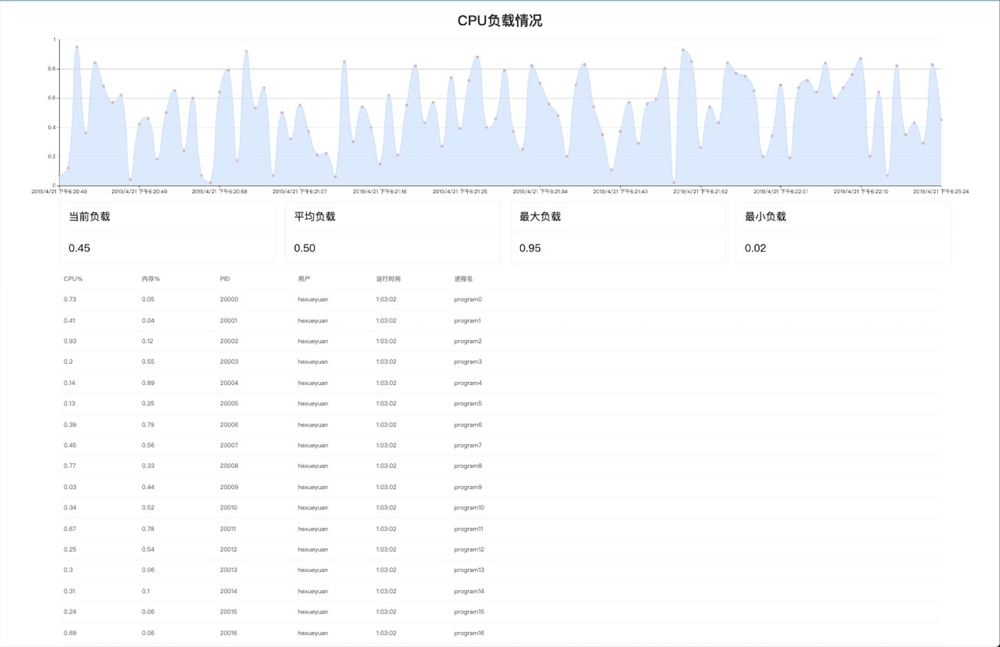
其他页面内容与CPU页面内容相似，并且由于模块化的设计，可以以很低的成本向页面中增删数据类型。

### 文件操作
文件操作需要后端和前端代码，其中后端需要实现文件相关的CURD操作，使用flask定义类视图，定义类的get、post、delete和put方法来实现处理不同的请求，其后端视图类设计代码如下：
```python
class FileSystem(MethodView):
    def get(self):
        if module_mode == "DEBUG":
            #p = os.path.join(module_debug_path, request.args.get('path', '/'))
            p = module_debug_path + request.args.get('path', '/')
        else:
            #p = os.path.join(module_release_path, request.args.get('path', '/'))
            p = module_release_path + request.args.get('path', '/')
        print p
        path = Path(p)

        if not path.exists():
            return "Not Found", 404
        
        if path.is_dir():
            return self.file_list(path)
        else:
            return self.file_content(path)

    def post(self):
        post_data = request.data
        data = json.loads(post_data)

        if not data.has_key('path') or not data.has_key('type'):
            return 'Bad Request:key', 400
        else:
            if module_mode == "DEBUG":
                p = os.path.join(module_debug_path, data['path'])
            else:
                p = os.path.join(module_release_path, data['path'])
            path = Path(p)

        try:
            if data['type'] == "directory":
                path.mkdir()
            elif data['type'] == "file":
                with path.open(mode='w') as f:
                    f.write(data.get('content', ''))
            else:
                return "Bad Request:type", 400
        except FileExistsError:
            return "Exists", 409
        except FileNotFoundError:
            return "Not Found:parent", 404
        except Exception:
            return "server error:Unknown exception", 500

    def file_list(self, path):
        prefix = module_debug_path if module_mode == 'DEBUG' else module_release_path
        items = []
        if str(path) != module_release_path:
            items.append({
                'name': '..',
                'path': str(path.parent).replace(prefix, ''),
                'type': 'directory'
            })
        for subPath in path.iterdir():
            item = {
                'name': subPath.name,
                'path': str(subPath).replace(prefix, '')
            }
            if subPath.is_dir():
                item['type'] = 'directory'
            else:
                item['type'] = 'file'
            items.append(item)
        return json.dumps(items)

    def file_content(self, path):
        return 'test'
```
FileSystem类定义了get、post、delete和put方法，当前端请求注册路由时，会根据请求方法调用不同的视图函数。

# 第九章 结束语
## 本文总结
本文主要描述了一个用于帮助服务器运行维护的工具以及其设计思想和实现，首先描述了项目的环境搭建，以帮助用户可以二次开发或者使用本项目；然后讲述了前期需求调研分析，以及确定本项目相关功能的原因；接下来讲述了根据调研进行系统设计的过程，包括系统各个关键部分的设计模式以及涉及到的相关技术和工具进行的介绍；然后是每一个具体模块的实现代码分析以及效果展示。

## 知识技能学习情况
由于项目是一个web项目，因此需要非常熟悉web全栈开发的经验和技能，我需要学习大量的知识，并且做足够多的系统化调研和测试分析；前端需要考虑良好的用户体验，代码的可维护性，项目的可扩展性，并且实现配置化，因此我采用了vue作为前端开发的框架，Vue作为数据驱动的响应式的前端框架，已有大量的商业项目进行验证和实践，并且根据本项目需要展示大量数据的属性，选择数据驱动的Vue框架是非常正确的；作者在2019年一月初开始学习Vue框架，并且使用Vue框架编写了多个app用于学习和感受Vue的特性，因此对于Vue的优势感受颇深，其优秀的数据驱动界面响应非常满足作者开发本项目的需求，在学习过程中，也可以找到非常丰富的学习资料，并且Vue本身上手难度非常低，所以学习成本也非常小；
但是单一个Vue前端框架还远远不够，编写页面的组件也需要学习很多新的知识。最原始的方式是html+css编写页面布局以及组件的样式，对于经验丰富的前端开发工程师来讲这非常简单，但是本项目关注点并非在此，因此作者没有花费过多时间在此，而是选择了element.js库封装好的UI组件，element.js里封装了常见的页面组件，包括表格、按钮、输入框、弹窗、浮窗、进度条、树形图等等，并且提供现有的主题风格，接口简单，即取即用，开发成本非常小，界面风格非常统一；作者在学习Vue的同时也在学习Element.js，其上手难度也非常低；
前端页面需要聚焦的在线编辑功能，我经过调研之后，从兼容性、稳定性、可扩展性以及项目更新频率来考虑之后选择使用markdown.js作为前端页面的编辑插件，编辑插件自身是通过对html原生的编辑框进行扩展的，markdown编辑器可以实现对文本文件的在线编辑，支持语言源文件代码高亮显示，支持markdown在线预览等，markdown.js使用文档详细描述了如何在Vue中使用该插件，所以使用成本也非常小；
web后端我选择了使用Python+flask进行开发，python版本使用的python2，后期会采用升级至python3并兼容python2的方案；使用flask作为server框架的原因是flask是一个功能齐全并且非常轻量级的框架，相比较于Djiango和Tornado，flask没有集成丰富的解决方案，这让他本身显得非常整洁和轻量，在一些需要复杂的业务逻辑场景中，这是flask的缺陷，但是在本项目中，由于没有复杂且大量的请求和数据库操作，flask的功能和性能刚好能够满足需求。flask也有非常丰富的使用案例以及详细的用户手册，不需要花费大量时间去学习即可掌握，环境搭建成本也非常小；
作者在开发本项目时已经具有一定的web开发基础，因此本项目知识技能学习重点并没有放在基础知识上，而是更多地关注程序的稳定性、安全性和可扩展性等等；如何写出高度可读性并且易维护的代码，是一个优秀的工程师应该考虑的问题，开发者必须对自己的代码的每个部分都了如指掌，了解系统的瓶颈、优势和缺陷，这样才能在遇到问题的时候不至于无从下手；我在开发该项目时，参考了很多优秀的Vue后端管理APP的界面，参考了Vue组件化设计的思想，将常用的组件抽象出来，提高代码的复用程度；同时我阅读了很多前辈关于如何编写具有可读性和可维护性代码的文章，旨在提高项目的质量。

## 工程计划和管理情况
本项目于2019年1月份启动，经过了前期调研、需求分析、确定功能、项目开发、后期测试等软件工程的完整生命周期，需要制定非常完整和仔细的开发计划，并按照计划认真执行；截止到4月下旬项目已经接近尾声，后期对本项目主要是一些优化工程。

## 职业素养和工程理论的学习和培养
通过主导本项目的开发，我深刻地认识到作为一个开发人员必须具备非常高的职业素养；首先是知识和技能学习能力，我们需要掌握本专业和行业相关到工程科学技术知识，掌握相关工具到使用，掌握软件工程设计和研发相关知识，具备良好的学习能力以适应新的先进技术和知识的出现；然后是素质要求，要有良好的思想道德品质，善于与他人进行合作交流，自觉遵守法律法规，能够履行承诺，同时积极锻炼身体，具备健全到生理和心理素质。

## 本项目有待进一步解决的问题以及方向
本项目距离商业项目还有很大到差距，这是作者在前期调研时就预料到的问题，所以在系统设计上为后续开发做了充足到准备，无论是整体设计还是细节设计都对扩展非常友好，因此任何一个人都可以非常轻松地搭建本项目开发环境进行二次开发；以下几个方向是本项目需要进一步优化的：
* 登录验证，登录时页面直接传输用户数据，包括用户名和密码，这部分会存在相关安全问题，需要进行优化，采用加密方式传输加密后的验证数据以保证用户数据的安全性；
* 更多的数据类型监控，由于时间原因本项目只对服务器的CPU、内存和磁盘数据进行了采集，为满足更多用户的需求，应该包括更多的监控数据，并且对于监控数据还应该有更多的数据分析等；
* 登录角色与系统角色绑定，本项目登录用户与系统用户是不相关的，这意味着权限管理对于登录用户来说是没有意义的。
* webssh界面风格的适配，因为开发成本原因，没有对webssh的界面风格进行修改，因此webssh界面和项目风格会有差异。

## 本人毕业设计（顶岗实习）收获及体会
通过在SAP实习以及对毕业设计的开发，学习了很多新的知识，同时也对已经掌握的知识进行了巩固和复习；企业环境对人会有更多的要求，在企业会更加关注开发者的产出，这里会有完善的软件工程开发模式，人与人的交流也会更加频繁，作为新人，需要融入这个新的环境，学习和吸收一切有益的知识；毕业设计是对我们大学期间所学知识的一个总结，它涉及了我们课堂上所学知识的每一个方面，是对我们即将走向社会之前的最后一个检测。

## 对软件工程实践以及软件工程领域发展的认识
软件工程如今逐渐朝着模块化、开源化和分布式等方向发展，软件收费不再是如今互联网行业的主流，服务收费慢慢成为趋势。随着云计算、大数据以及人工智能、机器学习等技术的兴起，行业对数据、算法等的要求越来越高，硬件设备的发展不断提高计算机的计算速度，随着计算能力的提升，人们越来越想从数据中获取到更多的信息，这催生了新的技术的出现，同时也对开发人员提出了更高地要求，我们必须夯实基础知识。